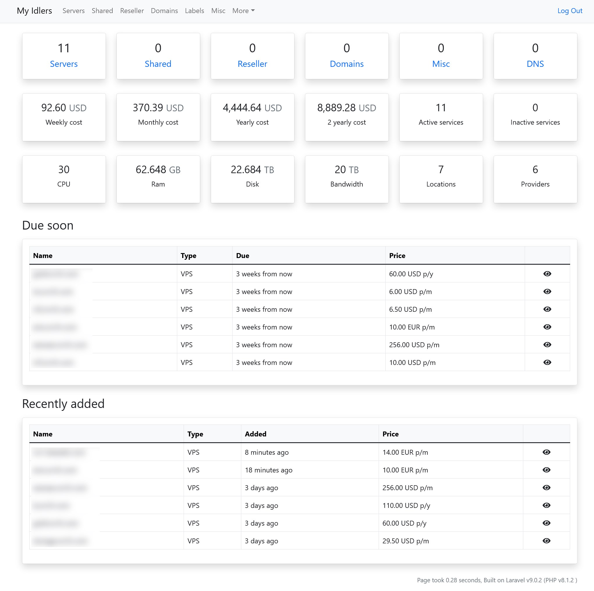

<!--
NOTA: Este README foi creado automáticamente por <https://github.com/YunoHost/apps/tree/master/tools/readme_generator>
NON debe editarse manualmente.
-->

# My Idlers para YunoHost

[](https://ci-apps.yunohost.org/ci/apps/my_idlers/)


[](https://install-app.yunohost.org/?app=my_idlers)

*[Le este README en outros idiomas.](./ALL_README.md)*

> *Este paquete permíteche instalar My Idlers de xeito rápido e doado nun servidor YunoHost.*  
> *Se non usas YunoHost, le a [documentación](https://yunohost.org/install) para saber como instalalo.*

## Vista xeral

If you are the person in your family, group of friends or colleauges that manages the servers, domain names, online accounts and other hosted services, than this app is for you. 

My Idlers is a useful register for keeping track of your servers and online hosting accounts. 

It is a single-user app; if more than one person wants to use this functionality, it needs to be installed multiple times. 
Besides that, for now, it needs a (sub)domain for itself. 

This is my first app packaging attempt; there may be some rough edges. 

What works: 
* installing the app and using its features
* uninstalling 
* backup
* moving the app to another domain

What does not (yet?) work or is untested:
* installing the app in subfolder
* LDAP integration
* restore from backup 
* API access 




**Versión proporcionada:** 3.0~ynh1

**Demo:** <https://demo.myidlers.com/login>

## Capturas de pantalla


## Documentación e recursos

- Documentación oficial para usuarias: <https://lowendspirit.com/discussion/2449/my-idlers-self-hosted-web-app-for-your-servers-shared-hosting-and-domains-information/>
- Repositorio de orixe do código: <https://github.com/cp6/my-idlers#install>
- Tenda YunoHost: <https://apps.yunohost.org/app/my_idlers>
- Informar dun problema: <https://github.com/YunoHost-Apps/my_idlers_ynh/issues>

## Info de desenvolvemento

Envía a túa colaboración á [rama `testing`](https://github.com/YunoHost-Apps/my_idlers_ynh/tree/testing).

Para probar a rama `testing`, procede deste xeito:

```bash
sudo yunohost app install https://github.com/YunoHost-Apps/my_idlers_ynh/tree/testing --debug
ou
sudo yunohost app upgrade my_idlers -u https://github.com/YunoHost-Apps/my_idlers_ynh/tree/testing --debug
```

**Máis info sobre o empaquetado da app:** <https://yunohost.org/packaging_apps>
